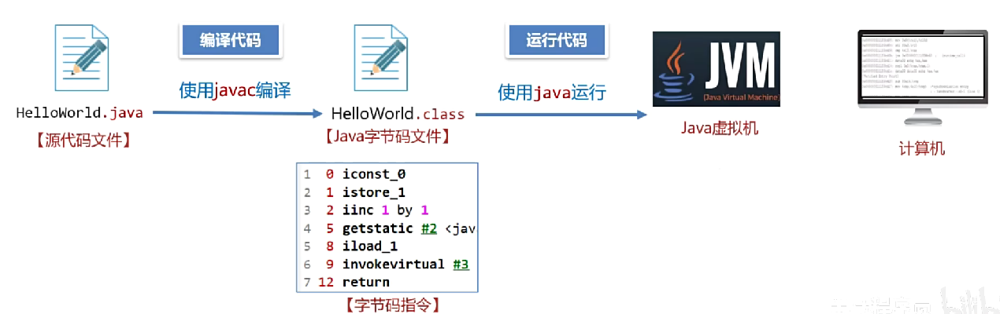
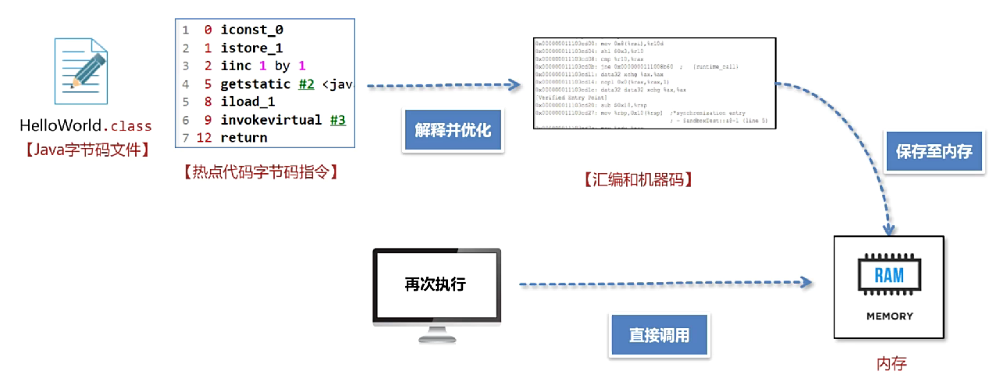
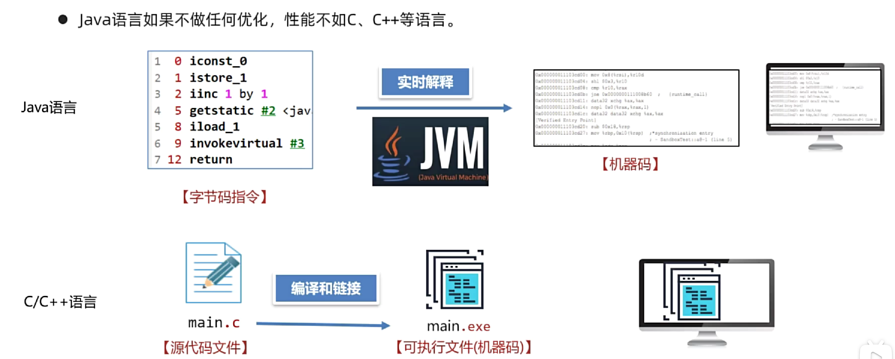
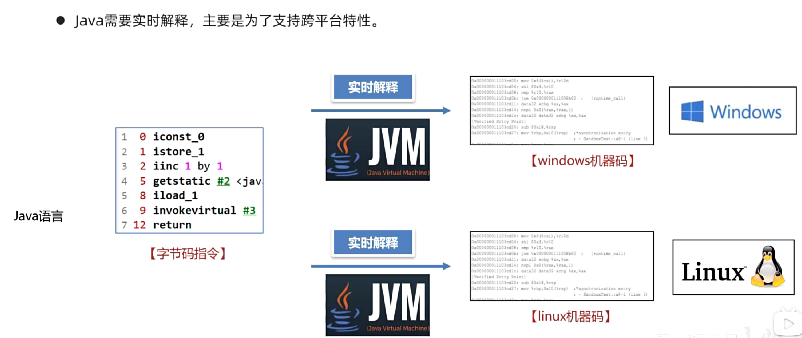
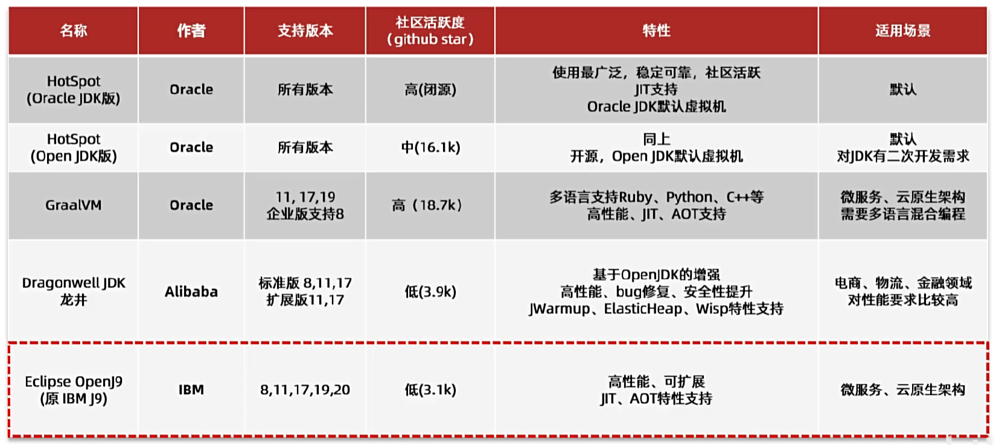
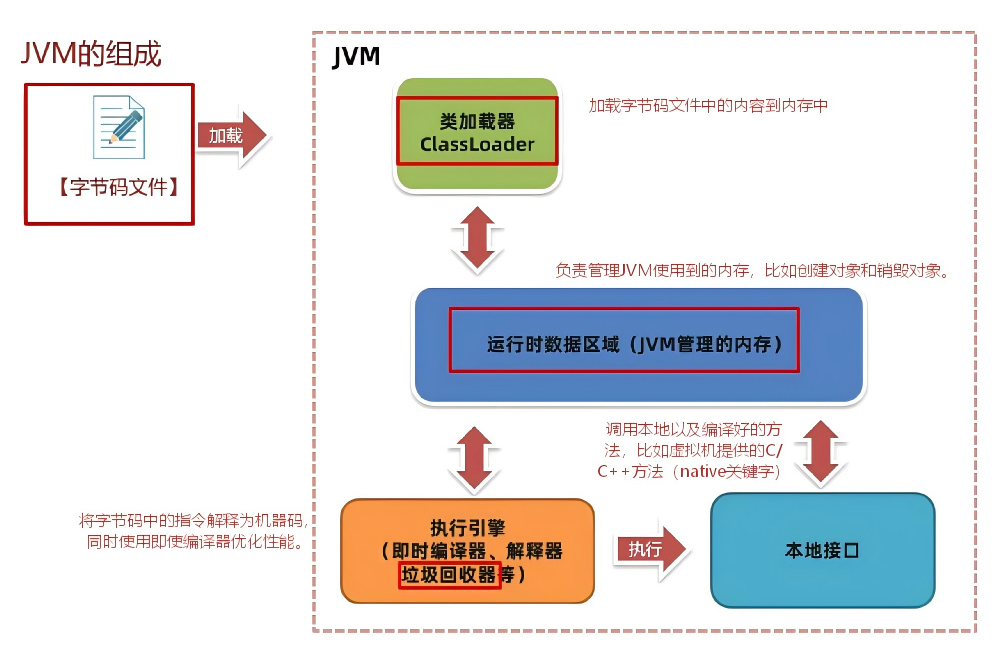
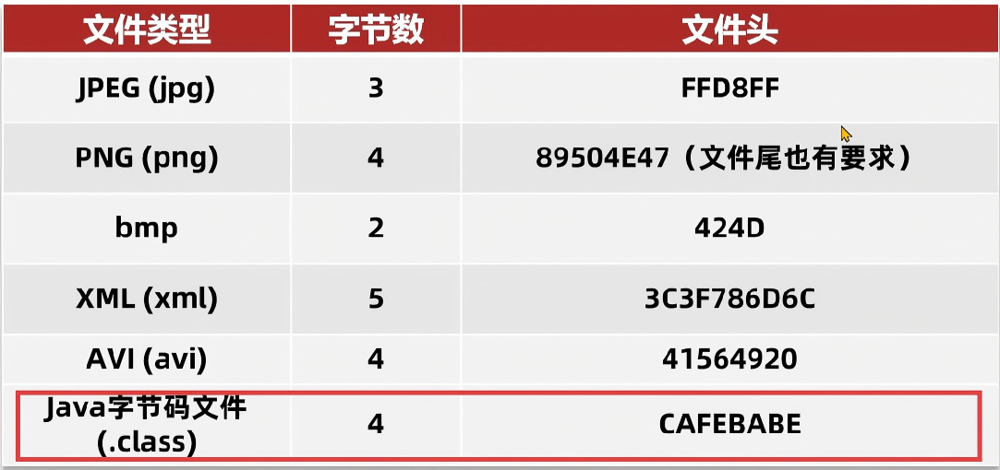
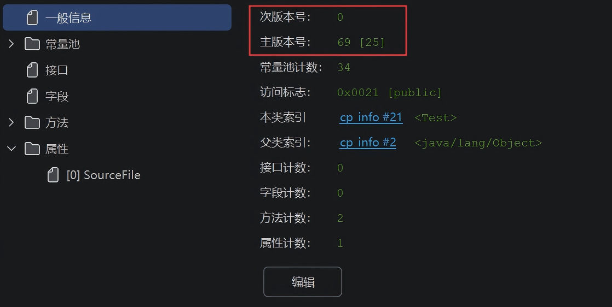
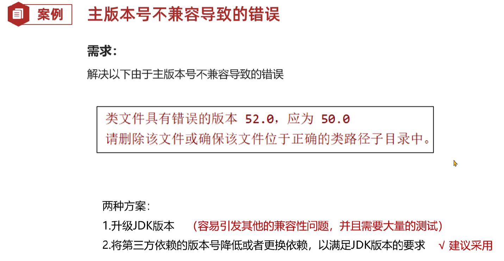
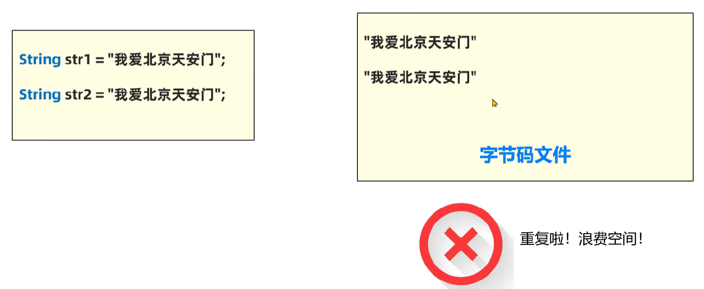

# JVM 基础篇

作者：闫世杰

---

## 1. 初识 JVM

### 1.1 概述

> JVM（Java虚拟机），负责**运行Java字节码文件**。

### 1.2 功能

1. 解释和运行
   -  对字节码文件中的指令，实时的解释成机器码，让计算机执行。

2. 内存管理

   - 自动为对象、方法等分配内存。
   - 自动的垃圾回收机制，回收不再使用的对象。

3. 即时编译（提升性能核心手段）

   - 对热点代码（很短时间内多次调用）进行优化。

   

   - 主要是为了支持跨平台特性。

   

   - 由于JVM需要实时解释虚拟机指令，不做任何性能优化不如直接运行机器码C、C++语言。

   

### 1.3 常见的JVM

### 1.4 总结

1. JVM是什么？

​	JVM全称是Java Virtual Machine（Java虚拟机），是一个运行在计算机上负责运行Java字节码文件的程序。

2. JVM三大核心功能？

​	内存管理、解释和执行虚拟机指令、即时编译。

3. 常见的JVM有哪些？

​	HotSpot、GraalVM、OpenJ9等，另外DragonWell龙井JDK（增强版的JVM）。其中使用最广泛的是HotSpot虚拟机（自带）。

---

## 2. JVM 组成

---

## 3. 字节码文件

### 3.1 概述

> IDEA安装`jclasslib`插件

### 3.2 基础信息

1. Magic 魔数

- 文件是无法通过文件扩展名来确定文件类型，文件扩展名可以随意更改。
- 软件使用文件头几个字节（文件头）去交易文件类型，如果软件不支持改类型就会出错。
- **字节码文件中将文件头称为magic魔数。**

2. 主副版本号

- 主副版本号是指编译字节码文件的JDK版本号。
- 主版本号用来标识大版本，JDK1.0使用了45.0、45.3，JDK1.2是46之后每升级一个大版本就+1。
- 副版本号是当大版本相同时用来区分不同版本的标识，一般只需要关系主版本号。
- **版本号作用是用来判断当前字节码版本和运行时JDK是否兼容。**

### 3.3 常量池

1. **作用：避免相同内容重复定义，节省空间。**

### 3.4 方法

